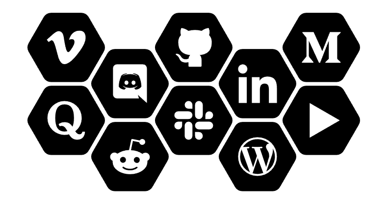

# HoneyCombLayoutJs

HoneyCombLayoutJs is a small, pure JavaScript library that automatically transforms a container (with user-defined data attributes) into a honeycomb (hexagonal) layout. 

You can specify orientation (flat‐top or pointy‐top), rows, columns, size, and spacing directly in HTML `data-` attributes



## Features

- **Flat‐top or Pointy‐top**: Choose the hex orientation by setting `data-orientationlabel`.
- **Customizable**: Control rows, columns, size, and spacing via HTML `data-` attributes.
- **Pure JavaScript**: No frameworks or build steps required. Just include the script.
- **Flexible**: Works with any `<a>` elements containing `` (e.g., SVG, PNG...).

## Installation

Include the script in your HTML page:
   ```html
   <script src="https://raw.githack.com/hasielhassan/HoneyCombLayoutJs/main/script.js"></script>
   ```

## Usage

1. **Add a container** in your HTML with the class `honeycomb-container` (or any selector you prefer) and define the layout parameters as `data-` attributes:
   ```html
   <div class="honeycomb-container"
        data-orientationlabel="flat-top"
        data-rowsrange="2"
        data-colsrange="3"
        data-sizerange="60"
        data-spacingrange="16"
   >
     <a href="/example/link1">
       
     </a>
     <a href="/example/link2">
       
     </a>
     <a href="/example/link3">
       
     </a>
     <!-- Add more anchors/images as needed -->
   </div>
   ```

2. **Call the library** after the DOM has loaded:
   ```html
   <script>
     document.addEventListener('DOMContentLoaded', () => {
       buildHoneycomb('.honeycomb-container');
     });
   </script>
   ```

---

## Data Attributes

- **`data-orientationlabel`**: `"flat-top"` or `"pointy-top"`  
  Determines how hexagons are offset in the grid.
- **`data-rowsrange`**: Number of rows in the layout (integer).
- **`data-colsrange`**: Number of columns in the layout (integer).
- **`data-sizerange`**: Radius (in pixels) from hex center to a corner (number).
- **`data-spacingrange`**: Spacing (in pixels) between adjacent hex centers (number).

---

## Example

```html
<!DOCTYPE html>
<html lang="en">
<head>
  <meta charset="UTF-8">
  <title>HoneyCombLayoutJs Demo</title>
  <link rel="stylesheet" href="styles.css">
</head>
<body>

  <div class="honeycomb-container"
       data-orientationlabel="flat-top"
       data-rowsrange="2"
       data-colsrange="5"
       data-sizerange="80"
       data-spacingrange="10"
  >
    <a href="https://www.vimeo.com">
      
    </a>
    <a href="https://www.discord.com">
      
    </a>
    <a href="https://www.github.com">
      
    </a>
    <a href="https://www.linkedin.com">
      
    </a>
    <a href="https://www.medium.com">
      
    </a>
    <a href="https://www.quora.com">
      
    </a>
    <a href="https://www.reddit.com">
      
    </a>
    <a href="https://www.slack.com">
      
    </a>
    <a href="https://www.wordpress.com">
      
    </a>
    <a href="https://www.youtube.com">
      
    </a>
  </div>

  <script src="HoneyCombLayout.js"></script>
  <script>
    document.addEventListener('DOMContentLoaded', function() {
      buildHoneycomb('.honeycomb-container');
    });
  </script>

</body>
</html>
```


## Important Notes

- **Absolute Positioning**: The container is set to `position: relative;`, and each item is absolutely positioned. Make sure your CSS does not override this.
- **Responsiveness**: Out of the box, the layout uses fixed rows, columns, and sizes. If you need a responsive layout that recalculates on window resize, you can call `buildHoneycomb()` again inside a `window.onresize` event or use a more dynamic approach.
- **SVG Icons**: If your `` sources are SVG files shaped like hexagons, they will seamlessly line up to form a honeycomb. Otherwise, you’ll see the bounding boxes, but the shape can still appear hex-like if you adjust styling.
- **Overflow**: The container’s final size is computed from the maximum row and column. If you have fewer items than `rows * cols`, you’ll still get the bounding box sized for the full grid. Adjust logic if you want it to shrink to exactly fit the items.

## Attributions

- Sample Icons: <a href="https://www.iconpacks.net/free-icon-pack/free-social-media-black-hexagon-icon-pack-256.html" title="qr-code-scan icons">Social Media Black Hexagon Icon Pack by Icons Packs</a>

## License
- [MIT License](LICENSE)

